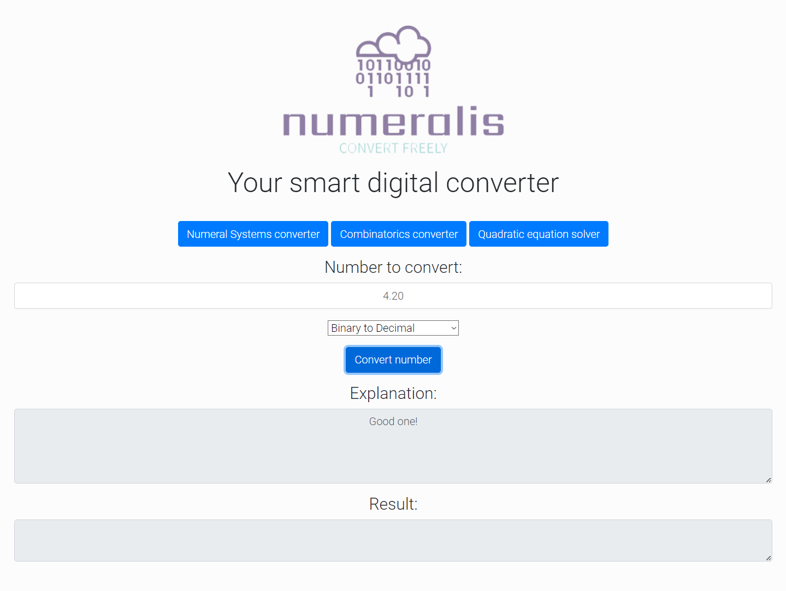

# First attempt to make a small project

The piece here is called Numeralis.
It gets a number from a keyboard input.
Then it gives you a drop-down menu with different options for conversion.
By clicking the button "Convert" the convertor checks if your input matches what type of numeral system has been selected.

If by the small off chance you have given unacceptable input the explanation field will give you some corrective feedback.
Otherwise you are presented with the converted number that you have requested.

Created by Lord Radoslav Tsepenishev

